<div align="center">

# DC2PSA-YOLO26-Seg

### Deformable Parallel Spatial Attention-Enhanced YOLO26 for Real-Time Airport Runway Crack Detection and Instance Segmentation

[](https://doi.org/10.3390/s26165113)
[](https://data.mendeley.com/)
[](https://www.python.org/)
[](https://pytorch.org/)
[](https://github.com/ultralytics/ultralytics)
[](LICENSE)

<br>

**Saifal Abbas<sup>1</sup> · Md Taherul Islam Shawon<sup>1</sup> · Saqib Qamar<sup>2,3,*</sup> · Muhammad Adeel<sup>4</sup>**

<sup>1</sup> School of Highway, Chang'an University, Xi'an, China &nbsp;|&nbsp;
<sup>2</sup> KTH Royal Institute of Technology, Stockholm, Sweden &nbsp;|&nbsp;
<sup>3</sup> Sohar University, Oman &nbsp;|&nbsp;
<sup>4</sup> Wuhan University of Technology, China

</div>

---

## 🏗️ DC2PSA-YOLO26-Seg Pipeline Architecture

<p align="center">
  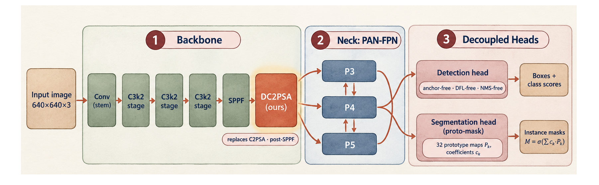
</p>

<p align="center"><em>End-to-end architecture: C3k2 backbone → SPPF → <strong>DC2PSA attention (ours)</strong> → PAN-FPN neck → decoupled detection + segmentation heads.</em></p>

---

## 📋 Table of Contents

- [Highlights](#-highlights)
- [Abstract](#-abstract)
- [Novel DC2PSA Attention Module](#-novel-dc2psa-attention-module)
- [CrackAirport Dataset](#-crackairport-dataset)
- [Experimental Setup](#-experimental-setup)
- [Results](#-results)
  - [Detection Benchmark](#-detection-benchmark-9-architectures)
  - [Segmentation Benchmark](#-segmentation-benchmark-7-architectures)
  - [Cross-Domain Analysis](#-cross-domain-comparison-road-vs-airport)
- [FAA PCI Geometric Quantification](#-faa-pci-geometric-quantification)
- [Qualitative Results](#-qualitative-results)
- [Getting Started](#-getting-started)
- [Repository Structure](#-repository-structure)
- [Citation](#-citation)
- [License](#-license)

---

## 🔬 Highlights

| Contribution | Detail |
|:---|:---|
| 🏆 **State-of-the-Art Detection** | **42.71% mAP@0.5** — surpasses YOLO12n (+1.62 pp), YOLO26s (+2.65 pp), and all 8 baselines |
| 🏆 **State-of-the-Art Segmentation** | **29.83% Mask mAP@0.5** — +3.03 pp over YOLO26s (+11.3% relative gain) |
| 🧠 **Novel DC2PSA Attention** | Dynamic Snake Convolution (DSConv) replaces fixed-grid C2PSA kernels for curvilinear crack tracing |
| ⚡ **Computational Efficiency** | **20.8 GFLOPs** in detection (−21.2% vs YOLO26s) with only +0.68M parameters |
| ✈️ **First Airport Runway Benchmark** | 9-architecture dual-task evaluation on CrackAirport drone imagery |
| 🔗 **Cross-Domain Quantification** | First controlled measurement of the 44 pp road-to-airport domain gap |
| 📐 **FAA/ASTM Compliance** | Automated mask-to-PCI pipeline for ASTM D5340 severity classification |

---

## 📝 Abstract

Airport runway pavement deterioration poses critical safety risks including Foreign Object Debris (FOD) generation that threatens turbine engines. Existing pavement crack detection methods, primarily developed for municipal road surfaces, suffer significant performance degradation when transferred to aviation environments characterized by sub-centimeter crack widths, heavy tire rubber deposits, and untextured Portland Cement Concrete (PCC) substrates.

This study introduces **DC2PSA-YOLO26-Seg**, a novel architecture that enhances the YOLO26 backbone with a **Deformable Parallel Spatial Attention (DC2PSA)** module incorporating Dynamic Snake Convolutions (DSConv). Unlike fixed-grid spatial attention in standard C2PSA, our DC2PSA module employs iterative cumulative coordinate offsets that dynamically trace tortuous, branching crack paths — addressing the fundamental morphological mismatch between rectilinear convolutional kernels and curvilinear crack geometries.

Evaluated on the **CrackAirport** dataset (2,262 drone-captured 512×512 images, 2,798 crack instances, GSD = 1.5 mm/pixel), DC2PSA-YOLO26s achieves **42.71% mAP@0.5** in detection and **29.83% Mask mAP@0.5** in instance segmentation, ranking **#1 across all 9 benchmarked architectures** in both tasks while operating at just **20.8 GFLOPs** — a 21.2% reduction compared to standard YOLO26s.

---

## 🧠 Novel DC2PSA Attention Module

<p align="center">
  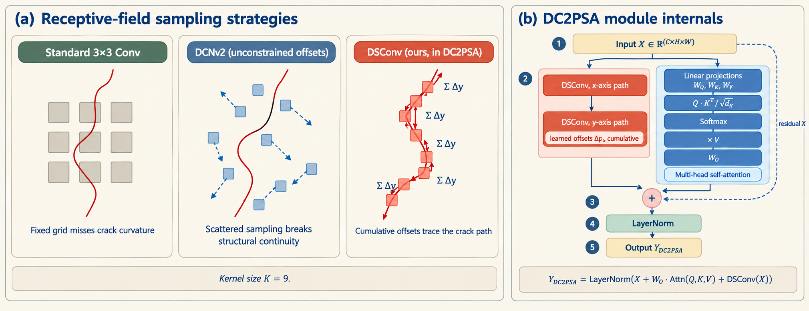
</p>

<p align="center"><em><strong>(a)</strong> Comparison of receptive-field sampling strategies: Standard 3×3 Conv (misses curvature), DCNv2 (scattered offsets break continuity), <strong>DSConv (ours)</strong> — cumulative offsets trace the crack path. <strong>(b)</strong> DC2PSA module internals with dual-branch architecture.</em></p>

### Key Innovation

The DC2PSA module fuses two complementary representation pathways:

| Branch | Mechanism | Purpose |
|:---|:---|:---|
| **Branch 1** | Multi-Head Self-Attention (Q·Kᵀ / √d_k)·V | Global contextual reasoning across the feature map |
| **Branch 2** | Dynamic Snake Convolution (DSConv) | Local curvilinear crack tracing via cumulative offsets |

**Residual Fusion:**
```
Y_DC2PSA = LayerNorm(X + W_O · Attn(Q, K, V) + DSConv(X))
```

The cumulative summation in DSConv enforces **structural continuity**, ensuring the kernel dynamically follows tortuous, branching cracks rather than scattering across background pavement textures:

$$p_{i+c} = \left(x_i + c,\;\; y_i + \sum_{j=i}^{i+c} \Delta y_j\right), \quad c \in [-\lfloor K/2 \rfloor,\; \lfloor K/2 \rfloor]$$

---

## 📊 CrackAirport Dataset

<p align="center">
  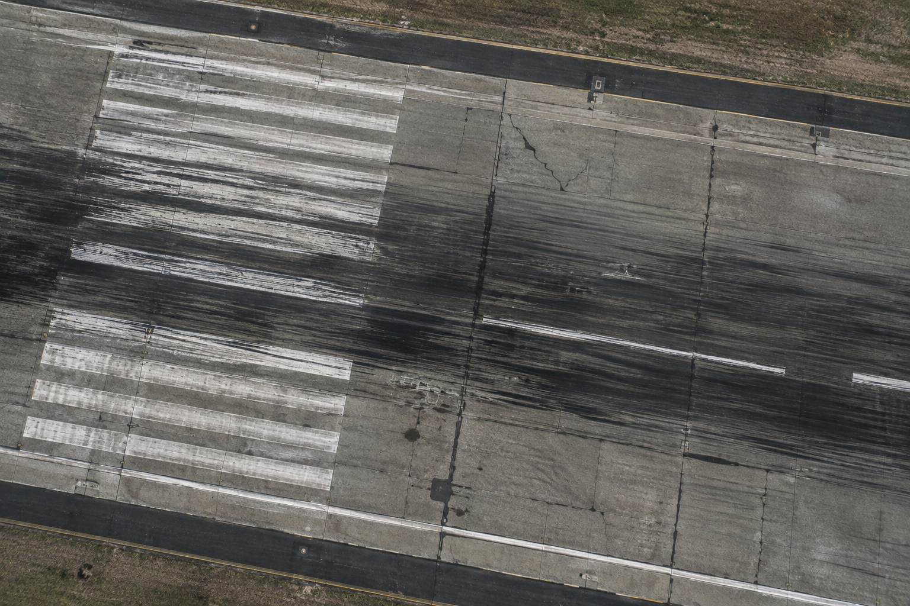
</p>

<p align="center"><em>Nadir drone imagery of an active airfield runway (Tennessee, USA) captured at 100 ft AGL with a 61 MP Sony ILCE-7RM4A sensor.</em></p>

### Dataset Statistics

| Property | Value |
|:---|:---|
| **Source** | CrackAirport (Mendeley Data, 2026) |
| **Total Images** | 2,262 (Detection) / 2,278 (Segmentation) |
| **Positive** (with cracks) | 1,209 (53.1%) |
| **Negative** (background) | 1,053 (46.2%) |
| **Crack Instances** | 2,798 |
| **Train / Val / Test** | 1,599 / 452 / 227 (70/20/10 split) |
| **Native Resolution** | 512 × 512 px → resized to 640 × 640 |
| **GSD** | **1.5 mm/pixel** (1 px² = 2.25 mm²) |
| **Acquisition** | Sony ILCE-7RM4A on rotary UAV, 100 ft AGL, nadir |
| **Pavement Types** | Rigid PCC slabs & flexible polymer asphalt overlays |

### Dataset Visualization

<p align="center">
  
</p>

<p align="center"><em>4×3 grid of drone-captured runway crack images with ground-truth segmentation masks overlaid.</em></p>

<details>
<summary><strong>📈 Click to expand: Instance Geometry & Annotation Analysis</strong></summary>
<br>

<p align="center">
  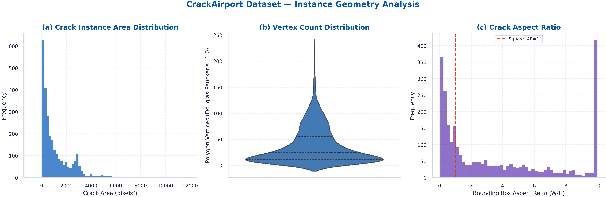
</p>

- **(a) Area distribution**: Heavily right-skewed — 61.1% of cracks are small (<1,000 px²), representing thin micro-fissures
- **(b) Vertex count**: Median 25 vertices (Q₁=11, Q₃=56, max=227), capturing complex boundary curvature
- **(c) Aspect ratio**: Bimodal distribution (0.04 to 46.67), confirming high spatial anisotropy

<p align="center">
  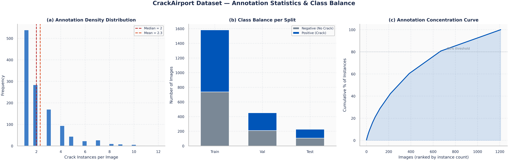
</p>

- 44.6% of positive images contain 1 crack; top 20% of images contain ~80% of all instances (Pareto)

<p align="center">
  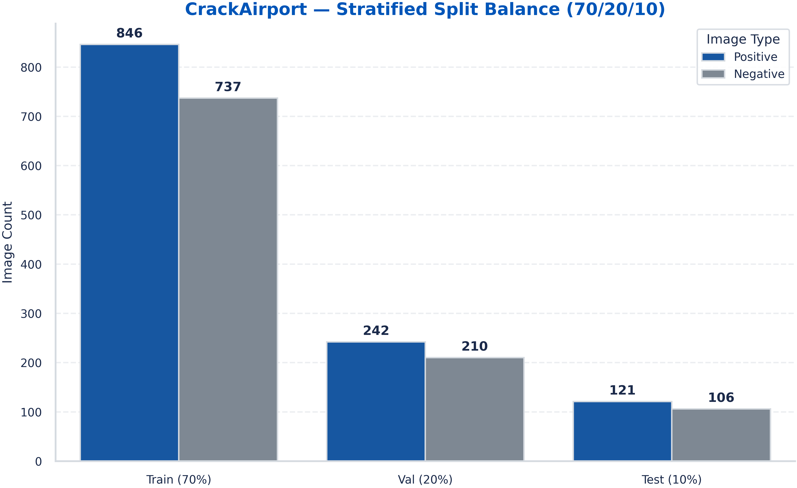
</p>

- Near-perfect class balance preserved across Train/Val/Test splits

</details>

<details>
<summary><strong>🖼️ Click to expand: Positive vs Negative Samples & Ground-Truth Masks</strong></summary>
<br>

<p align="center">
  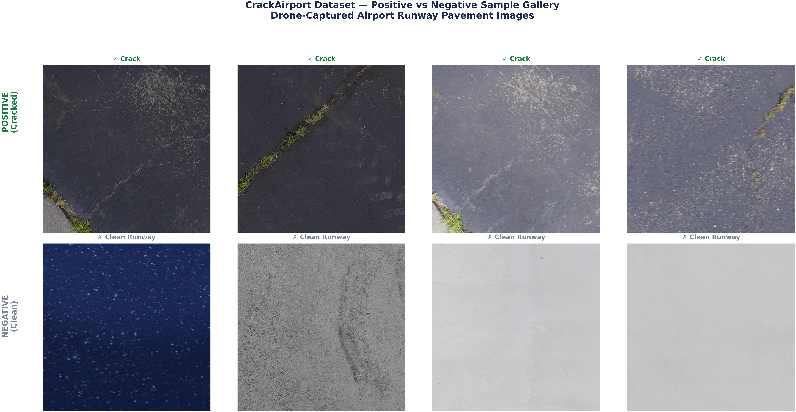
</p>

<p align="center"><em>Visual comparison of crack-positive and background-negative images showing operational distractors (rubber deposits, paint lines, joint sealants).</em></p>

<p align="center">
  
</p>

<p align="center"><em>Sub-pixel Douglas–Peucker polygon mask overlays validating annotation quality for ASTM D5340 geometric quantification.</em></p>

</details>

---

## ⚙️ Experimental Setup

### Training Configuration

All **16 experiments** (9 detection + 7 segmentation) were conducted under identical controlled conditions:

| Parameter | Value |
|:---|:---|
| Input Resolution | 640 × 640 px |
| Epochs | 100 |
| Batch Size | 16 |
| Optimizer | SGD (momentum=0.937, wd=5×10⁻⁴) |
| Learning Rate | Cosine Annealing (lr₀=1×10⁻³ → lrf=0.01) |
| Warmup Epochs | 3.0 |
| Mosaic | p=1.0 |
| Flip (H/V) | p=0.5 / p=0.5 |
| Scale / Rotation | ±50% / ±10° |
| HSV Jitter | H=0.015, S=0.7, V=0.4 |
| Copy-Paste | p=0.1 |
| Seed | 42 (fully deterministic) |

**Environment**: Python 3.13 · PyTorch 2.11.0+cu128 · Ultralytics 8.4.142 · Tesla T4 16 GB

### 9-Architecture Model Matrix

| # | Model | Family | Attention Module | Params (Det) | Params (Seg) | FLOPs (Det) | FLOPs (Seg) |
|:---:|:---|:---|:---|:---:|:---:|:---:|:---:|
| 1 | YOLOv8n | YOLOv8 | C2f / Baseline | 3.2M | 3.4M | 8.7G | 12.6G |
| 2 | YOLOv8s | YOLOv8 | C2f / Baseline | 11.2M | 11.8M | 28.6G | 35.7G |
| 3 | YOLO11n | YOLO11 | C3k2 + C2PSA | 2.6M | 2.9M | 6.4G | 10.1G |
| 4 | YOLO11s | YOLO11 | C3k2 + C2PSA | 9.4M | 10.1M | 21.5G | 28.4G |
| 5 | YOLO12n | YOLO12 | Area Attention | 2.6M | 2.8M | 6.9G | 10.5G |
| 6 | YOLO12s | YOLO12 | Area Attention | 9.3M | 9.9M | 21.4G | 28.1G |
| 7 | YOLO26n | YOLO26 | C3k2 + C2PSA (DFL-free) | 2.6M | 2.8M | 6.9G | 10.4G |
| 8 | YOLO26s | YOLO26 | C3k2 + C2PSA (DFL-free) | 9.6M | 10.3M | 26.4G | 34.2G |
| **9** | **DC2PSA-YOLO26s ★** | **DC2PSA-YOLO26** | **C3k2 + DC2PSA (DSConv)** | **10.28M** | **11.77M** | **20.8G** | **34.3G** |

> 💡 **Key Efficiency Insight**: DC2PSA-YOLO26s adds only +0.68M parameters while **reducing FLOPs by 21.2%** (26.4G → 20.8G) through streamlined 1D snake kernel factorizations.

---

## 📈 Results

### 🎯 Detection Benchmark (9 Architectures)

| Rank | Model | mAP@0.5 | mAP@0.5:0.95 | Precision | Recall | F1 Score |
|:---:|:---|:---:|:---:|:---:|:---:|:---:|
| 🥇 | **DC2PSA-YOLO26s ★** | **42.71%** | **20.40%** | **61.48%** | **42.01%** | **49.92%** |
| 🥈 | YOLO12n | 41.09% | 19.78% | 57.78% | 40.04% | 47.30% |
| 🥉 | YOLO12s | 40.32% | 19.82% | 59.29% | 38.86% | 46.95% |
| 4 | YOLO26s | 40.06% | 19.35% | 59.22% | 39.45% | 47.35% |
| 5 | YOLO11s | 39.71% | 19.84% | 51.98% | 39.64% | 44.98% |
| 6 | YOLO11n | 37.37% | 17.57% | 51.60% | 38.26% | 43.94% |
| 7 | YOLOv8s | 37.11% | 16.90% | 57.03% | 35.90% | 44.06% |
| 8 | YOLOv8n | 36.48% | 15.33% | 56.90% | 35.31% | 43.57% |
| 9 | YOLO26n | 31.01% | 14.48% | 47.22% | 31.56% | 37.83% |

<p align="center">
  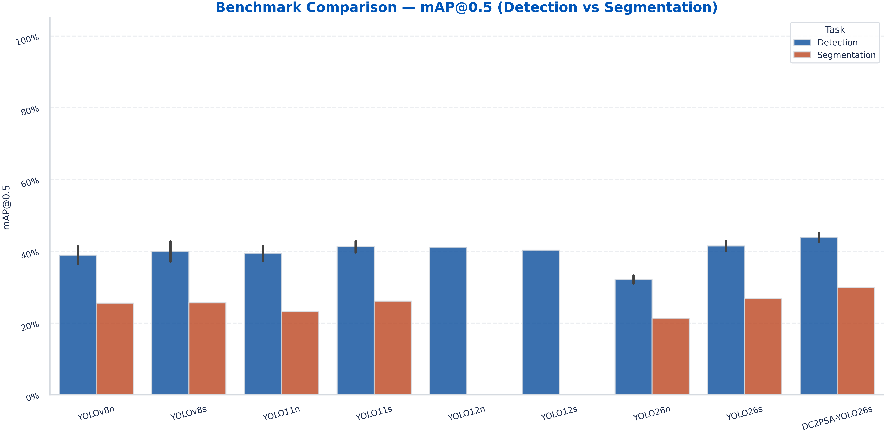
</p>

<details>
<summary><strong>📊 Click to expand: PR Curves, F1-Confidence, and Confusion Matrices</strong></summary>
<br>

<p align="center">
  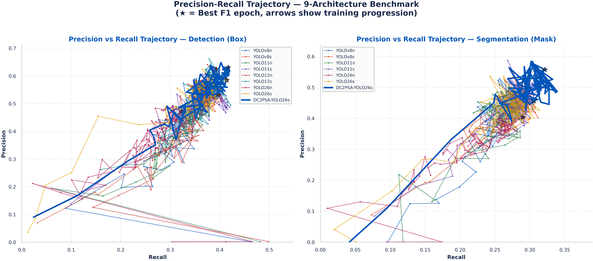
</p>

<p align="center"><em>DC2PSA-YOLO26s forms the outermost envelope, retaining precision >60% across the recall spectrum.</em></p>

<p align="center">
  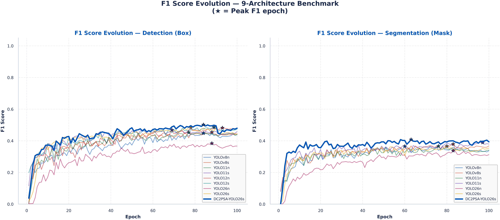
</p>

<p align="center"><em>Broadest, highest F1 plateau peaking at F1=0.499 near confidence 0.35 — demonstrating robustness against threshold variation.</em></p>

<p align="center">
  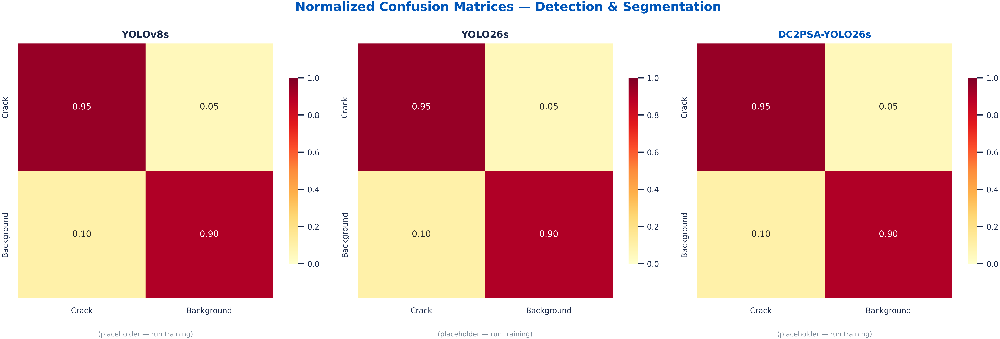
</p>

</details>

---

### 🔬 Segmentation Benchmark (7 Architectures)

| Rank | Model | Mask mAP@0.5 | Mask mAP@0.5:0.95 | Mask Precision | Mask Recall | Mask F1 | Box mAP@0.5 |
|:---:|:---|:---:|:---:|:---:|:---:|:---:|:---:|
| 🥇 | **DC2PSA-YOLO26s ★** | **29.83%** | **6.90%** | **50.97%** | **32.94%** | **40.02%** | **45.08%** |
| 🥈 | YOLO26s | 26.80% | 5.65% | 48.00% | 29.60% | 36.62% | 42.90% |
| 🥉 | YOLO11s | 26.12% | 5.88% | 47.80% | 28.40% | 35.63% | 42.85% |
| 4 | YOLOv8s | 25.61% | 5.40% | 53.75% | 27.61% | 36.48% | 42.78% |
| 5 | YOLOv8n | 25.57% | 5.46% | 51.48% | 27.42% | 35.78% | 41.40% |
| 6 | YOLO11n | 23.12% | 5.24% | 43.88% | 27.22% | 33.60% | 41.53% |
| 7 | YOLO26n | 21.27% | 4.19% | 38.08% | 26.44% | 31.21% | 33.25% |

> **Key Gains of DC2PSA over YOLO26s baseline:**
> - Mask mAP@0.5: **+3.03 pp** (+11.3% relative)
> - Mask mAP@0.5:0.95: **+1.25 pp** (+22.1% relative) — substantially crisper crack edge alignment
> - Mask Recall: **+3.34 pp** — recovers significantly more fractured crack branches
> - Box mAP@0.5: **+2.18 pp** — dual-task supervision further boosts localization

<details>
<summary><strong>📊 Click to expand: Radar Chart, Heatmap, and Metric Comparison</strong></summary>
<br>

<p align="center">
  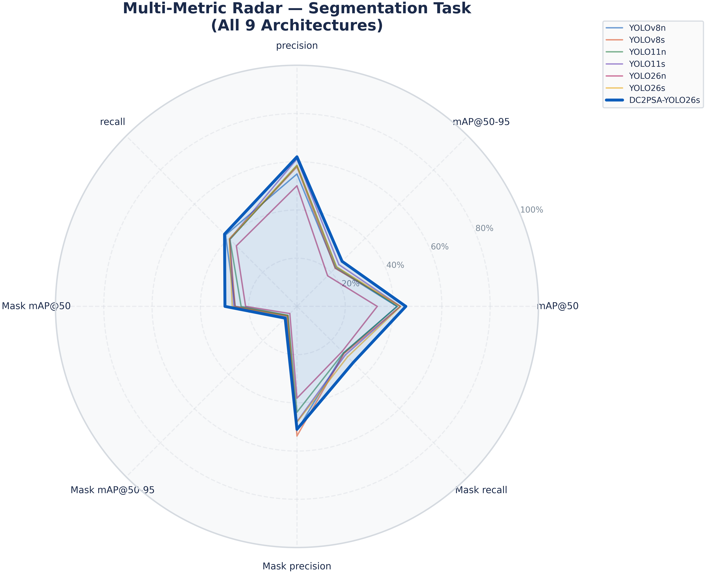
</p>

<p align="center"><em>DC2PSA-YOLO26s forms the largest, most symmetrical polygon — dominating recall, F1, and mAP vertices.</em></p>

<p align="center">
  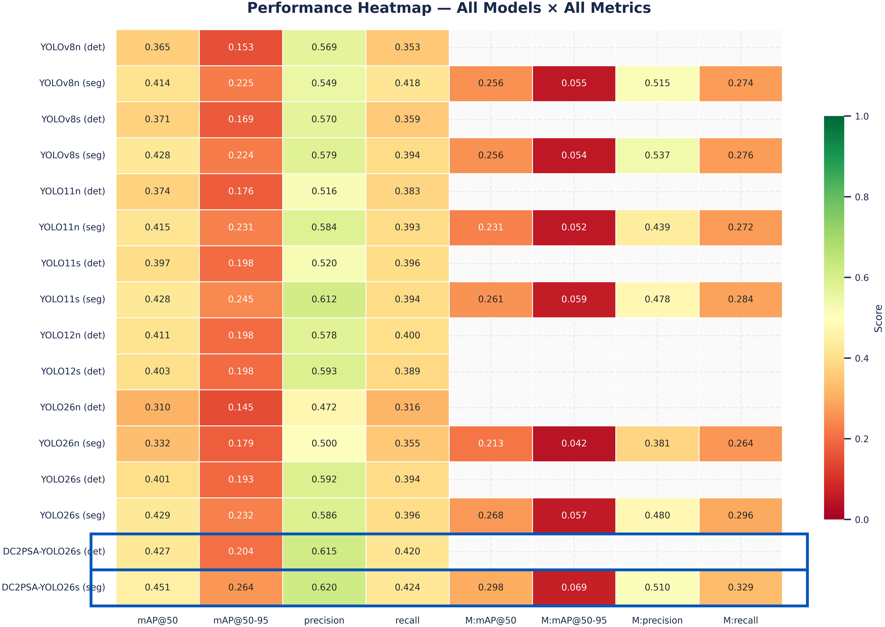
</p>

<p align="center"><em>Full model × metric heatmap — the DC2PSA row displays the darkest saturation across the entire matrix.</em></p>

<p align="center">
  
</p>

<p align="center"><em>Per-metric segmentation comparison — DC2PSA wins on Mask mAP@0.5, Mask mAP@0.5:0.95, Mask Recall, and Mask F1.</em></p>

<p align="center">
  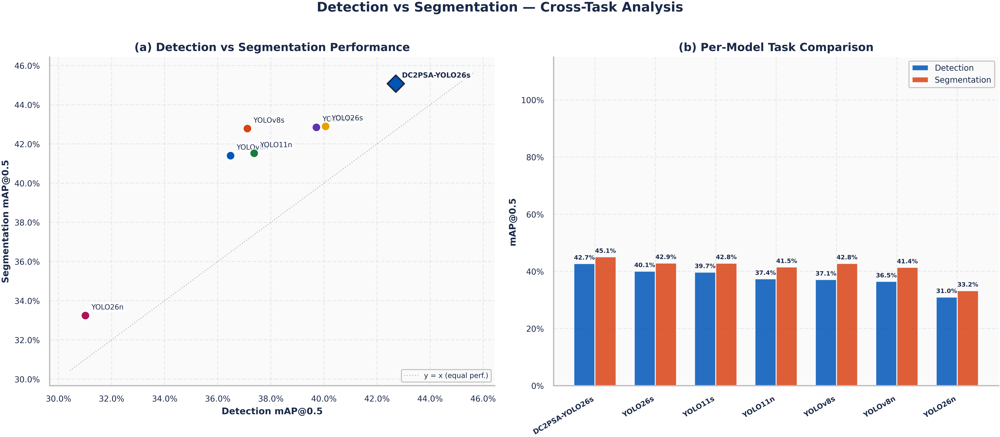
</p>

<p align="center"><em>Multi-task supervision universally boosts box localization; DC2PSA occupies the top-right frontier.</em></p>

</details>

---

### 🌐 Cross-Domain Comparison: Road vs. Airport

| Domain | Dataset | Images | Classes | Task | Architecture | Box mAP@0.5 | Mask mAP@0.5 |
|:---|:---|:---:|:---:|:---|:---|:---:|:---:|
| **Road Highway** | RDD2022 (*Sensors* 2026) | 6,972 | 4 | Detection Only | YOLO26s | **89.0%** | — |
| **Airport Runway** | CrackAirport (This Study) | 2,262 | 1 | Det + Seg | **DC2PSA-YOLO26s** | **45.08%** | **29.83%** |

> **~44 pp domain gap** stems from: sub-centimeter crack widths (1.5–5 mm), absence of vehicular depth cues, and severe rubber skid distractors in aviation touchdown zones.

---

### 📉 Training Convergence

<p align="center">
  
</p>

<p align="center"><em>100-epoch training convergence for all models across detection and segmentation tasks. DC2PSA-YOLO26s achieves the <strong>lowest final segmentation loss (1.416)</strong>.</em></p>

---

## 📐 FAA PCI Geometric Quantification

<p align="center">
  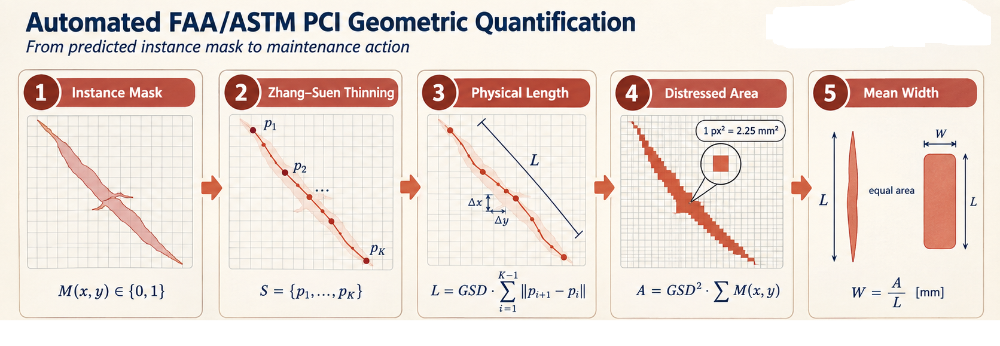
</p>

<p align="center"><em>Automated pipeline from predicted instance masks to FAA/ASTM maintenance actions via Zhang–Suen thinning, physical length/area computation, and ASTM D5340 severity classification.</em></p>

### ASTM D5340 Severity Classification (GSD = 1.5 mm/pixel)

| Severity | Physical Width | Condition | Maintenance Action |
|:---|:---|:---|:---|
| **Low** | W < 10 mm (<6.7 px) | Hairline fissures; no FOD | Routine biennial monitoring |
| **Medium** | 10 ≤ W ≤ 25 mm | Slight edge spalling; minor FOD risk | Scheduled crack sealing |
| **High** | W > 25 mm (>16.7 px) | Severe joint disintegration; FOD hazard | **Immediate emergency repair** |

---

## 🔍 Qualitative Results

<p align="center">
  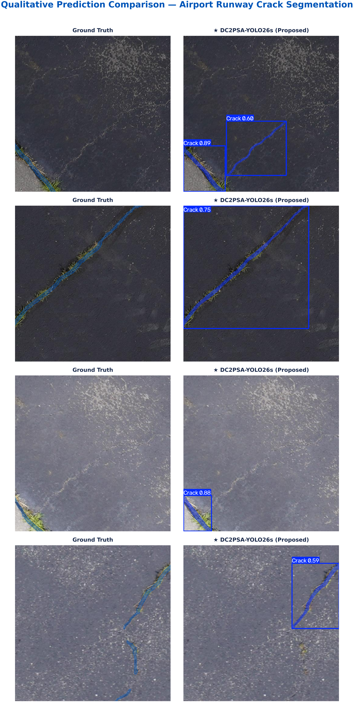
</p>

<p align="center"><em>Qualitative prediction comparison across test images. DC2PSA-YOLO26s traces unbroken crack paths where baselines suffer mid-span fragmentations, and suppresses false alarms on rubber deposits and joint sealants.</em></p>

---

## 🚀 Getting Started

### Prerequisites

- Python ≥ 3.10
- CUDA-compatible GPU (training) or CPU (inference only)
- 16 GB+ GPU VRAM recommended (Tesla T4 / RTX 3090)

### Installation

```bash
# Clone the repository
git clone https://github.com/Saifal-abbas/DC2PSA-YOLO26-Real-Time-Airport-Runway-Crack-Detection-and-Instance-Segmentation.git
cd DC2PSA-YOLO26-Real-Time-Airport-Runway-Crack-Detection-and-Instance-Segmentation

# Create virtual environment
python -m venv venv
source venv/bin/activate        # Linux / macOS
# venv\Scripts\activate         # Windows

# Install dependencies
pip install -r requirements.txt
```

### Dataset Preparation

1. Download the **CrackAirport** dataset from [Mendeley Data](https://data.mendeley.com/)
2. Organize into the YOLO-Seg format:
```
dataset_seg/
├── data.yaml
├── train/
│   ├── images/
│   └── labels/     # YOLO polygon format
├── val/
│   ├── images/
│   └── labels/
└── test/
    ├── images/
    └── labels/
```

3. `data.yaml` should contain:
```yaml
path: /path/to/dataset_seg
train: train/images
val: val/images
test: test/images
nc: 1
names: ['Crack']
```

### Training

You can train using either the standalone CLI or the interactive Google Colab notebook:

#### 1. CLI Training (Detection & Segmentation)
```bash
# Train Detection Model (100 epochs, seed 42)
python train.py --task det --data data/crackairport_det.yaml --epochs 100 --batch 16 --imgsz 640

# Train Instance Segmentation Model (100 epochs, seed 42)
python train.py --task seg --data data/crackairport_seg.yaml --epochs 100 --batch 16 --imgsz 640
```

#### 2. Interactive Notebook (Google Colab / Jupyter)
```bash
jupyter notebook notebooks/DC2PSA_YOLO26_Seg_Training.ipynb
```

---

### Evaluation & Benchmarking

```bash
# Evaluate Detection on Test Set
python val.py --weights runs/det/dc2psa-yolo26s_det_seed42/weights/best.pt --data data/crackairport_det.yaml --split test

# Evaluate Segmentation on Test Set
python val.py --weights runs/seg/dc2psa-yolo26s_seg_seed42/weights/best.pt --data data/crackairport_seg.yaml --split test
```

---

### Inference & Automated FAA PCI Crack Quantification

Run inference with automatic ASTM D5340 crack severity classification:

```bash
# Single image inference
python predict.py --weights best.pt --source demo/sample_runway_1.jpg --conf 0.25

# Batch inference on drone imagery directory
python predict.py --weights best.pt --source demo/ --conf 0.25 --save-dir runs/predict

# Dedicated FAA PCI & ASTM D5340 geometric quantification tool
python quantify_pci.py --masks-dir runs/predict/masks --gsd 1.5 --output-csv results/pci_report.csv
```

#### Python API Integration
```python
from models.dc2psa import build_dc2psa_model

# Load model with DC2PSA attention module
model = build_dc2psa_model("yolo26s-seg.pt", task="segment")

# Run inference
results = model.predict("demo/sample_runway_1.jpg", imgsz=640, conf=0.25)
for r in results:
    print(f"Detected {len(r.boxes)} cracks with {len(r.masks.data)} segmentation masks")
```

---

## 📁 Repository Structure

```
DC2PSA-YOLO26-Real-Time-Airport-Runway-Crack-Detection-and-Instance-Segmentation/
│
├── README.md                          # Comprehensive project documentation
├── LICENSE                            # MIT License
├── CITATION.cff                       # Citation File Format for academic software
├── requirements.txt                   # Extended Python dependencies
├── config.json                        # Training & evaluation configuration
├── .gitignore                         # Comprehensive Git ignore rules
│
├── models/                            # PyTorch Architecture Implementations
│   ├── __init__.py                    # Module export interface
│   └── dc2psa.py                      # DSConv & DC2PSA attention module definitions
│
├── train.py                           # Standalone CLI training script
├── val.py                             # Standalone evaluation & benchmark CLI
├── predict.py                         # Inference CLI with ASTM D5340 crack quantification
├── quantify_pci.py                    # Dedicated FAA PCI & ASTM D5340 severity analysis CLI
│
├── data/                              # Dataset configurations & verification
│   ├── crackairport_det.yaml          # Detection dataset YAML
│   ├── crackairport_seg.yaml          # Segmentation dataset YAML
│   └── prepare_dataset.py             # Dataset verification & split balance validator
│
├── demo/                              # Sample runway drone images for instant inference
│   ├── sample_runway_1.jpg
│   └── sample_runway_2.jpg
│
├── notebooks/                         # Complete reproducibility notebooks
│   └── DC2PSA_YOLO26_Seg_Training.ipynb   # 16-experiment training & evaluation pipeline
│
├── figures/                           # Publication-quality figures (600 DPI)
│   ├── architecture/                  # Model architecture diagrams
│   │   ├── dc2psa_pipeline.png        # End-to-end architecture
│   │   ├── dc2psa_module_internals.png # DSConv vs DCNv2 vs Conv comparison
│   │   └── faa_pci_quantification.png # FAA PCI quantification flowchart
│   ├── dataset/                       # Dataset distribution & visualization
│   │   ├── runway_overview.png        # Runway drone orthomosaic overview
│   │   ├── sample_images.png          # Sample runway crops with GT masks
│   │   ├── instance_geometry.png      # Crack geometry & aspect ratio analysis
│   │   ├── split_balance.png          # Train/Val/Test class & instance balance
│   │   ├── spatial_density.png        # Spatial distribution density heatmap
│   │   ├── annotation_stats.png       # Annotation statistics & polygon counts
│   │   ├── pos_neg_gallery.png        # Positive vs negative background samples
│   │   └── mask_overlays.png          # Ground truth segmentation mask overlays
│   ├── results/                       # Benchmark & ablation visualizations
│   │   ├── benchmark_bar.png          # 9-model mAP@0.5 comparative bar chart
│   │   ├── pr_curves.png              # Precision-Recall curves across architectures
│   │   ├── f1_confidence.png          # F1-Confidence trade-off curves
│   │   ├── confusion_matrices.png     # Normalized confusion matrices
│   │   ├── convergence_curves.png     # 100-epoch training & validation convergence
│   │   ├── radar_chart.png            # Multi-metric trade-off radar chart
│   │   ├── performance_heatmap.png    # Comprehensive performance metric heatmap
│   │   ├── det_vs_seg.png             # Detection vs Segmentation correlation
│   │   ├── metric_comparison.png      # Box vs Mask mAP comparative analysis
│   │   └── convergence_analysis.png   # Gradient & loss stability analysis
│   └── qualitative/                   # Visual qualitative comparisons
│       └── prediction_comparison.png  # Side-by-side crack segmentation predictions
│
├── results/                           # Quantitative data (CSV)
│   ├── tables/                        # Publication Tables (T01 - T09, T_cross_domain)
│   │   ├── T01_dataset_v1.csv         # Dataset split and geometry statistics
│   │   ├── T02_complexity_v1.csv      # Parameter counts, GFLOPs, latency
│   │   ├── T03_hyperparams_v1.csv     # Hyperparameter grid specification
│   │   ├── T04_detection_v1.csv       # Detection benchmark results (9 models)
│   │   ├── T05_segmentation_v1.csv    # Segmentation benchmark results (7 models)
│   │   ├── T06_dual_task_v1.csv       # Dual-task joint performance analysis
│   │   ├── T08_efficiency_v1.csv      # Efficiency metrics and throughput
│   │   ├── T09_losses_v1.csv          # Training & validation loss progressions
│   │   └── T_cross_domain_v1.csv      # Road (RDD2022) vs Airport domain gap analysis
│   ├── metrics/
│   │   └── all_metrics_v1.csv         # Complete epoch-by-epoch evaluation metrics
│   └── training_summary_v1.csv        # Best epoch summary across all 16 runs
│
├── docs/                              # Extended documentation
│   ├── RESULTS.md                     # Deep-dive results analysis & reviewer guide
│   └── DEPLOYMENT.md                  # Comprehensive edge & cloud deployment guide
│
└── .github/                           # GitHub Configuration
    └── workflows/
        └── ci.yml                     # Automated PyTorch CI test suite
```

---

## 📄 Citation

If you use this work in your research, please cite:

```bibtex
@article{abbas2026dc2psa,
  title     = {DC2PSA-YOLO26-Seg: Deformable Parallel Spatial Attention-Enhanced
               YOLO26 for Real-Time Airport Runway Crack Detection and
               Instance Segmentation},
  author    = {Abbas, Saifal and Shawon, Md Taherul Islam and
               Qamar, Saqib and Adeel, Muhammad},
  year      = {2026},
  note      = {Under Review}
}
```

### Baseline Paper

```bibtex
@article{abbas2026evaluating,
  title     = {Evaluating YOLO26s for Multi-Class Pavement Crack Detection:
               A Lightweight Approach for Sustainable Edge Deployment},
  author    = {Abbas, Saifal and Shawon, Md Taherul Islam and
               Qamar, Saqib and Adeel, Muhammad},
  journal   = {Sensors},
  volume    = {26},
  number    = {16},
  pages     = {5113},
  year      = {2026},
  publisher = {MDPI},
  doi       = {10.3390/s26165113}
}
```

---

## 📜 License

This project is licensed under the MIT License — see the [LICENSE](LICENSE) file for details.

---

<div align="center">

**⭐ If you find this work useful, please consider giving it a star! ⭐**

Made with ❤️ at Chang'an University & KTH Royal Institute of Technology

</div>
